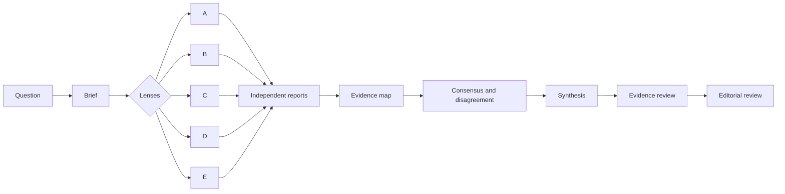
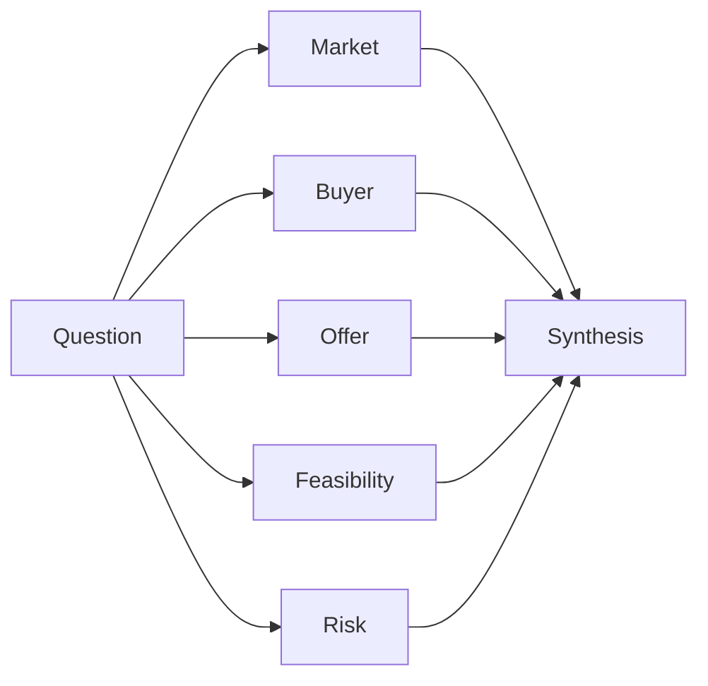
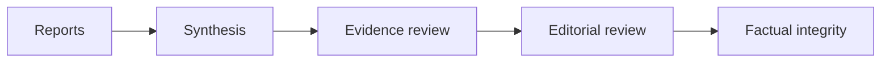

# Think Tank Research

**Multi-perspective research for decisions that should not depend on a single AI answer.**

[Versão principal em português](README.md)

Think Tank Research is an open research method packaged as an Agent Skill. It decomposes complex questions into analytical lenses with distinct mandates, confronts evidence and disagreements, and produces a synthesis with explicit uncertainty.

Instead of asking one model to reason simultaneously about market, audience, feasibility, risk, and implementation, the skill separates those criteria before synthesis.

> **The goal is not to produce more AI opinions. It is to make the decision process more inspectable.**

**Current version:** `0.2.1-beta` · **License:** MIT · **Portable package:** available in Releases

## Why I built this

A single AI answer often mixes evidence gathering, interpretation, objections, and recommendation into the same reasoning path. That makes it harder to see which criteria support the conclusion, which perspectives were omitted, when repetition is being mistaken for consensus, and which gaps should remain open instead of being filled by the model.

Think Tank Research experiments with a different architecture: each lens receives an explicit mandate and output contract; reports are produced before synthesis; disagreements are preserved; and factual review is separated from editorial review.

The design hypothesis is simple: **a decision becomes more auditable when different perspectives are required to expose their reasoning separately before anyone tries to reconcile them.**

## How it works



Personas are not fictional characters or simulated voices. Each one represents a **methodological lens** with its own scope, responsibilities, limits, and criteria.

The skill produces a research brief, three to seven specialized reports, an evidence map, a convergence/divergence matrix, a conditional recommendation, and two separate quality gates.

## Real cross-platform test

The same strategic question was executed in ChatGPT web and Claude.ai to test behavioral portability:

> **Should a small consultancy offer AI workshops for marketing teams in Brazil?** The report is intended for the partners and should separate demand, offer design, risk, and market testing.



The purpose was not to determine which model "won." The test checked whether different runtimes preserved the core behaviors of the method.

| Observed behavior | ChatGPT web | Claude.ai |
|---|---|---|
| Skill discovered and triggered | Yes | Yes |
| Lenses with distinct mandates | Yes | Yes |
| Runtime limitations declared | Yes | Yes |
| Evidence separated from inference | Yes | Yes |
| Disagreements preserved | Yes | Yes |
| Unknowns kept as unknowns | Yes | Yes |
| Evidence review | `PASS_WITH_LIMITATIONS` | `PASS_WITH_LIMITATIONS` |
| Editorial review | `PASS` | `PASS` |
| Conditional recommendation | Yes | Yes |

In the Claude.ai report, for example, incompatible market-size figures were explicitly discarded as unreliable; the lack of a public pricing benchmark remained an open gap; and the final recommendation was presented with medium confidence and conditioned on a commercial pilot. The runtime also declared that the five lenses were simulated sequentially by a single agent, documenting context-contamination risk rather than pretending to provide structural independence.

**Test evidence:**

- [cross-platform validation case](examples/validation-workshops-ia.md);
- [shared ChatGPT execution](https://chatgpt.com/share/e/6a98753f-ff3c-8001-a3eb-4736b6b74bfb);
- [simple-question example](examples/simple-question.md);
- [strategic-report example](examples/strategic-report.md).

## What makes the method different

| Principle | Implementation |
|---|---|
| **Distinct mandates** | each report receives its own scope and output contract |
| **Disagreement is information** | relevant conflicts are preserved before recommendation |
| **Evidence is not inference** | factual support, interpretation, hypotheses, and strategic opinion are distinguished |
| **Synthesis is not voting** | convergence is not automatically treated as truth |
| **Writing is not validation** | evidence review happens before editorial review |
| **Limitations are part of the result** | missing sources, low confidence, and runtime restrictions are declared |
| **Controlled degradation** | environments without subagents remain usable while loss of independence is made explicit |

## Quality controls



**Evidence review** checks support, claim classification, citations, gaps, source conflicts, and confidence.

**Editorial review** improves clarity, concision, language consistency, and readability **without changing facts, numbers, tables, or confidence levels**.

The editorial protocol was inspired by the public [`anti-ai-slop`](https://github.com/Hermes-brasil/hermes-brasil/tree/main/skills/anti-ai-slop) skill from Hermes Brasil and adapted for research. See the [evidence protocol](references/evidence-review.md) and [editorial protocol](references/editorial-review.md).

## Engineering highlights

Although the main deliverable is an instruction- and contract-based Agent Skill, the repository is structured as a distributable and verifiable software package.

- capability-based core with no proprietary tool names in the canonical method;
- runtime-specific adapters;
- three execution modes plus a provided-sources-only mode;
- explicit degradation when subagents or filesystem access are unavailable;
- reusable brief, report, and final-report templates;
- structural and privacy validation;
- unit and contract tests;
- deterministic builds;
- internal manifest and SHA-256 checksum;
- separation between development sources and portable distribution.

## Execution modes

| Mode | Best suited for | Main limitation |
|---|---|---|
| **Persistent workspace** | local agents with files and independent tasks | depends on enabled tools |
| **Sandbox** | web products with temporary files and tasks | persistence and external access may be limited |
| **Single session** | chats without subagents or filesystem | lower independence between lenses |

The report must declare which mode was used. See [execution modes](references/execution-modes.md).

## Compatibility and maturity

The core is platform-independent. Adapters translate capabilities for [Hermes Agent](adapters/hermes.md), [Codex](adapters/codex.md), [Claude Code](adapters/claude-code.md), and [ChatGPT / Claude.ai](adapters/web-sandboxes.md).

**Current status, version `0.2.1-beta`:**

| Environment | Status |
|---|---|
| **ChatGPT web** | end-to-end validated: installation, discovery, triggering, and complete report |
| **Claude.ai (Free)** | end-to-end validated, including autonomous selection of single-session mode |
| **Hermes Agent** | installed and locally validated, including discovery and triggering |
| **Codex** | architecture supported; end-to-end validation pending |
| **Claude Code** | architecture supported; end-to-end validation pending |

Architectural compatibility does not mean every capability is available in every account. Skills, subagents, external research, files, and persistence depend on product, plan, workspace, and configuration.

## Try it

If your AI environment can access GitHub and install Skills, send it this repository URL and ask:

> Install the Think Tank Research skill from this repository. Review its contents before copying, use the Skills mechanism available on this platform, and validate discovery without running a full research task.

Then try a question that genuinely involves conflicting criteria.

## `.zip` installation

For web products that support Skill uploads:

1. download `think-tank-research-portable.zip` from the published release;
2. verify its SHA-256 against `checksums.txt`;
3. review the package contents;
4. upload the `.zip` through the product's Skills interface;
5. validate triggering before starting a real research task.

If the account does not support Skill uploads, attach `SKILL.md`, the templates, and required references to the conversation and use single-session mode. See the platform adapter for specific instructions.

## Repository structure

```text
.
├── SKILL.md
├── adapters/
├── assets/
├── examples/
├── references/
├── scripts/
├── templates/
├── tests/
├── CHANGELOG.md
├── LICENSE
└── README.md
```

`SKILL.md` contains the portable core. Adapters translate capabilities to specific environments; references hold methodological protocols; templates define reusable contracts; scripts and tests verify the distribution.

## Validation and package

Requires Python 3.9 or newer.

```bash
python3 scripts/validate_package.py
python3 -m unittest tests/test_package.py -v
python3 scripts/build_distributions.py
```

The final command creates the portable package, an internal `MANIFEST.txt`, and `checksums.txt` with the package SHA-256. The build is deterministic: identical sources produce the same hash.

## Limitations

- Simulated personas are not human experts.
- Convergence between reports does not replace confirmation from independent sources.
- Without external access, current facts remain unverified.
- The skill does not replace professional assessment in medical, legal, financial, or safety-critical matters.
- Sequential mode has a higher risk of context contamination between lenses.
- The method organizes research and decision-making; it does not turn missing evidence into certainty.

## Roadmap

- [x] capability-based portable core;
- [x] runtime adapters;
- [x] separate evidence and editorial gates;
- [x] deterministic, verifiable package;
- [x] ChatGPT web end-to-end validation;
- [x] Claude.ai end-to-end validation;
- [x] Hermes Agent validation;
- [ ] Codex end-to-end validation;
- [ ] Claude Code end-to-end validation;
- [ ] stable release after compatibility gates.

## License and credit

MIT. See [LICENSE](LICENSE).

The editorial protocol adapts principles from the `anti-ai-slop` skill, also released under the MIT License by Hermes Brasil. This repository adds research-specific protections for evidence, structured data, and uncertainty.
