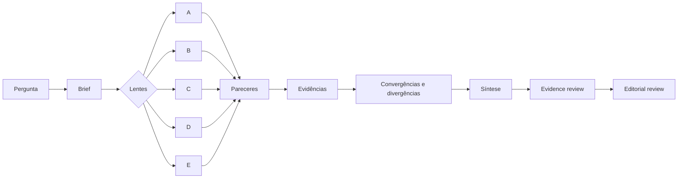
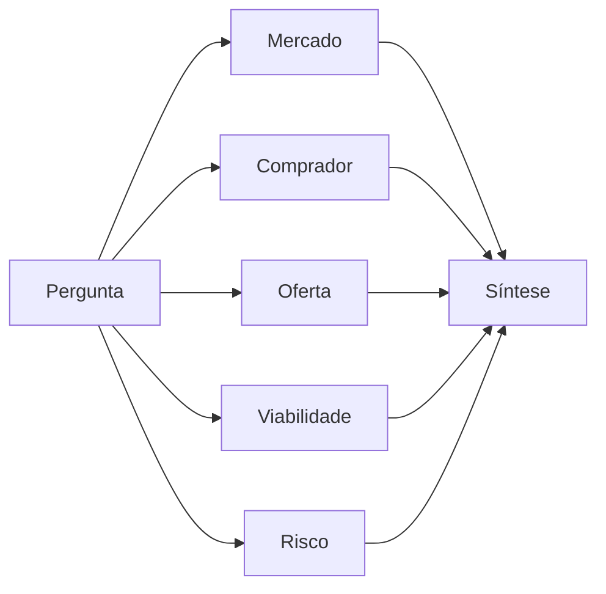
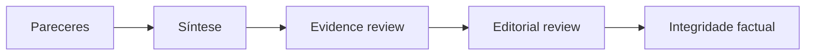

# Think Tank Research

**Pesquisa multi-perspectiva para decisões que não deveriam depender de uma única resposta de IA.**

[English version](README.en.md)

Think Tank Research é um método de pesquisa aberto, empacotado como Agent Skill, para decompor perguntas complexas em lentes analíticas com mandatos distintos, confrontar evidências e divergências e produzir uma síntese com incertezas explícitas.

Em vez de pedir a um único modelo que raciocine simultaneamente sobre mercado, público, viabilidade, risco e implementação, a skill separa esses critérios antes da síntese.

> **O objetivo não é produzir mais opiniões de IA. É tornar o processo de decisão mais inspecionável.**

**Versão atual:** `0.2.1-beta` · **Licença:** MIT · **Pacote portátil:** disponível em Releases

## Por que construí este projeto

Uma resposta única costuma misturar coleta de evidências, interpretação, objeções e recomendação no mesmo raciocínio. Isso dificulta perceber quais critérios sustentam a conclusão, quais perspectivas ficaram de fora, quando repetição está sendo confundida com consenso e quais lacunas deveriam permanecer abertas em vez de serem preenchidas pela IA.

O Think Tank Research experimenta outra arquitetura: cada lente recebe um mandato explícito e um contrato de saída; os pareceres são produzidos antes da síntese; divergências são preservadas; e a revisão factual é separada da revisão editorial.

A hipótese de design é simples: **uma decisão fica mais auditável quando perspectivas diferentes são obrigadas a mostrar seu raciocínio separadamente antes que alguém tente conciliá-las.**

## Como funciona



As personas não são personagens ou vozes fictícias. Cada uma representa uma **lente metodológica** com escopo, responsabilidades, limites e critérios próprios.

A skill entrega brief de pesquisa, três a sete pareceres especializados, mapa de evidências, matriz de convergências e divergências, recomendação condicionada e dois gates de qualidade separados.

## Teste real em duas plataformas

Para verificar portabilidade comportamental, a mesma pergunta estratégica foi executada no ChatGPT web e no Claude.ai:

> **Uma pequena consultoria deveria oferecer workshops de IA para equipes de marketing no Brasil?** O relatório será lido pelos sócios e deve separar demanda, desenho da oferta, risco e teste de mercado.



Os relatórios não foram usados para perguntar qual modelo "venceu". O teste observou se runtimes diferentes preservavam os comportamentos centrais do método.

| Comportamento observado | ChatGPT web | Claude.ai |
|---|---|---|
| Skill descoberta e acionada | Sim | Sim |
| Lentes com mandatos distintos | Sim | Sim |
| Limitações do ambiente declaradas | Sim | Sim |
| Evidência separada de inferência | Sim | Sim |
| Divergências preservadas | Sim | Sim |
| Lacunas mantidas como lacunas | Sim | Sim |
| Evidence review | `PASS_WITH_LIMITATIONS` | `PASS_WITH_LIMITATIONS` |
| Editorial review | `PASS` | `PASS` |
| Recomendação condicionada | Sim | Sim |

No relatório do Claude.ai, por exemplo, números incompatíveis de tamanho de mercado foram explicitamente descartados como não confiáveis; a ausência de benchmark público de preço permaneceu como lacuna; e a recomendação final foi apresentada com confiança média, condicionada a um piloto comercial. O ambiente também declarou que as cinco lentes haviam sido simuladas sequencialmente por um único agente, registrando o risco de contaminação de contexto em vez de fingir independência estrutural.

**Evidências do teste:**

- [caso de validação e comparação entre ambientes](examples/validation-workshops-ia.md);
- [execução compartilhada no ChatGPT](https://chatgpt.com/share/e/6a98753f-ff3c-8001-a3eb-4736b6b74bfb);
- [exemplo de pergunta simples](examples/simple-question.md);
- [exemplo de relatório estratégico](examples/strategic-report.md).

## O que diferencia o método

| Princípio | Implementação |
|---|---|
| **Lentes com mandatos distintos** | cada parecer recebe escopo e contrato de saída próprios |
| **Divergência é informação** | conflitos relevantes são preservados antes da recomendação |
| **Evidência não é inferência** | o relatório distingue sustentação factual, interpretação, hipótese e opinião estratégica |
| **Síntese não é votação** | convergência entre lentes não é tratada automaticamente como verdade |
| **Escrita não é validação** | revisão de evidências ocorre antes da revisão editorial |
| **Limitações são parte do resultado** | ausência de fonte, baixa confiança e restrições do ambiente são declaradas |
| **Degradação controlada** | ambientes sem subagentes continuam utilizáveis, mas a perda de independência é explicitada |

## Controles de qualidade

O método separa dois trabalhos que frequentemente aparecem misturados em fluxos de IA:



**Evidence review** verifica sustentação, classificação das afirmações, citações, lacunas, conflitos entre fontes e grau de confiança.

**Editorial review** melhora clareza, concisão, consistência de idioma e legibilidade **sem alterar fatos, números, tabelas ou grau de certeza**.

O protocolo editorial foi inspirado na skill pública [`anti-ai-slop`](https://github.com/Hermes-brasil/hermes-brasil/tree/main/skills/anti-ai-slop), do Hermes Brasil, e adaptado para pesquisa. Leia o [protocolo de evidências](references/evidence-review.md) e o [protocolo editorial](references/editorial-review.md).

## Engineering highlights

A entrega principal é uma Agent Skill baseada em instruções e contratos, mas o repositório foi tratado como um pacote de software distribuível e verificável.

- núcleo baseado em **capacidades**, sem nomes de ferramentas proprietárias no método canônico;
- adapters específicos por ambiente;
- três modos de execução e um modo limitado às fontes fornecidas;
- degradação explícita quando subagentes ou filesystem não estão disponíveis;
- templates reutilizáveis para brief, pareceres e relatório final;
- validação estrutural e de privacidade do pacote;
- testes unitários e de contrato;
- build determinístico;
- manifesto interno e checksum SHA-256 do artefato distribuído;
- separação entre fontes de desenvolvimento e pacote portátil.

## Modos de execução

| Modo | Quando usar | Limitação principal |
|---|---|---|
| **Workspace persistente** | agentes locais com arquivos e tarefas independentes | depende das ferramentas habilitadas |
| **Sandbox** | produtos web com arquivos temporários e tarefas | persistência e acesso externo podem ser limitados |
| **Sessão única** | chats sem subagentes ou filesystem | menor independência entre lentes |

A metodologia exige que o relatório declare qual modo foi usado. Consulte [os modos de execução](references/execution-modes.md).

## Compatibilidade e maturidade

O núcleo não depende de uma plataforma específica. Adapters traduzem capacidades para [Hermes Agent](adapters/hermes.md), [Codex](adapters/codex.md), [Claude Code](adapters/claude-code.md), [ChatGPT e Claude.ai](adapters/web-sandboxes.md).

**Estado atual, versão `0.2.1-beta`:**

| Ambiente | Estado |
|---|---|
| **ChatGPT web** | homologado ponta a ponta: instalação, descoberta, acionamento e relatório completo |
| **Claude.ai (Free)** | homologado ponta a ponta, incluindo escolha autônoma do modo de sessão única |
| **Hermes Agent** | instalado e validado localmente, com descoberta e acionamento verificados |
| **Codex** | arquitetura suportada; homologação ponta a ponta pendente |
| **Claude Code** | arquitetura suportada; homologação ponta a ponta pendente |

Compatibilidade arquitetural não significa que todas as capacidades estejam disponíveis em qualquer conta. Skills, subagentes, pesquisa externa, arquivos e persistência dependem do produto, plano, workspace e configuração.

## Experimente

Se sua IA tiver acesso ao GitHub e permissão para instalar Skills, envie o endereço deste repositório e peça:

> Instale a skill Think Tank Research a partir deste repositório. Revise o conteúdo antes de copiar, use o mecanismo de Skills disponível nesta plataforma e valide a descoberta sem executar uma pesquisa completa.

Depois, experimente uma pergunta que realmente exija critérios conflitantes. Uma solicitação melhor informa pergunta, público, recorte geográfico e temporal, fontes disponíveis, profundidade, sensibilidades e formato desejado.

## Instalação por `.zip`

Para produtos web compatíveis com upload de Skills:

1. baixe `think-tank-research-portable.zip` nos artefatos da versão publicada;
2. confira o SHA-256 em `checksums.txt`;
3. revise os arquivos do pacote;
4. envie o `.zip` pela interface de Skills do produto;
5. valide o acionamento sem iniciar uma pesquisa real.

Se a conta não oferecer upload de Skills, anexe `SKILL.md`, os templates e as referências necessárias à conversa e use o modo de sessão única. Consulte o adapter da plataforma para instruções específicas.

## Estrutura do repositório

```text
.
├── SKILL.md
├── adapters/
├── assets/
├── examples/
├── references/
├── scripts/
├── templates/
├── tests/
├── CHANGELOG.md
├── LICENSE
└── README.md
```

O `SKILL.md` contém o núcleo portátil. Os adapters traduzem capacidades para ambientes específicos; referências guardam protocolos metodológicos; templates definem contratos reutilizáveis; scripts e testes verificam a distribuição.

## Validação e pacote

Requer apenas Python 3.9 ou superior.

```bash
python3 scripts/validate_package.py
python3 -m unittest tests/test_package.py -v
python3 scripts/build_distributions.py
```

O último comando cria em `dist/` o pacote portátil, `MANIFEST.txt` com hashes internos e `checksums.txt` com o SHA-256 do pacote. O build é determinístico: fontes idênticas produzem o mesmo hash.

## Limites

- Personas simuladas não são especialistas humanos consultados.
- Convergência entre pareceres não substitui confirmação por fontes independentes.
- Sem acesso externo, fatos atuais permanecem não verificados.
- A skill não substitui avaliação profissional em temas médicos, jurídicos, financeiros ou de segurança.
- O modo sequencial tem maior risco de contaminação entre lentes.
- O método organiza pesquisa e decisão; ele não transforma ausência de evidência em certeza.

## Roadmap

- [x] núcleo portátil baseado em capacidades;
- [x] adapters para diferentes ambientes;
- [x] gates separados de evidência e revisão editorial;
- [x] build determinístico e pacote verificável;
- [x] homologação no ChatGPT web;
- [x] homologação no Claude.ai;
- [x] validação no Hermes Agent;
- [ ] homologação ponta a ponta no Codex;
- [ ] homologação ponta a ponta no Claude Code;
- [ ] promoção para versão estável após os gates de compatibilidade.

## Licença e crédito

MIT. Consulte [LICENSE](LICENSE).

O protocolo editorial adapta princípios da skill `anti-ai-slop`, também publicada sob licença MIT pelo projeto Hermes Brasil. A implementação deste repositório acrescenta proteções específicas para evidências, dados estruturados e incerteza de pesquisa.
